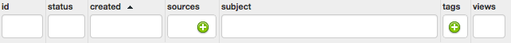
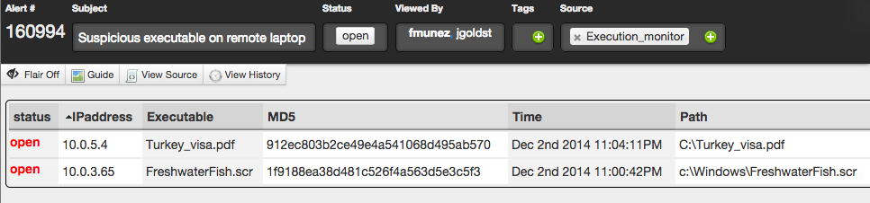
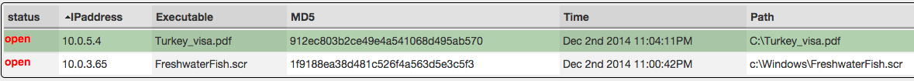

Handling High Confidence alerts in SCOT
=======================================

Alert Grid
^^^^^^^^^^

To access the Alert Grid, click on the “Alert” button in the Navigation Bar at the top. The grid will appear in which we see a list of alerts that have come in and need to be triaged. Each row represents a group of alerts that came in together and are possibly related. Let’s go over what each of the columns in the grid means.

:Status:  The status can be either *open* (no action taken), *closed* (no action needed), or *promoted* (more analysis needed).  All alertgroups come into SCOT as "open".
:Sources:  The "sources" column identifies the systems/organizations/processes that are responsible for creating the alert.
:Subject:  The subject is a quick description of the alertgroup.  If the alert came in through email, this is the email subject.
:Tags: Tags are seen as a catchall and are useful in subsequent searches for alerts with a specific set of tags.
:Views: You can also filter by the number of times a particular alert has been viewed to know if anyone else on your team has looked at it.

Each column contains a textbox to filter the grid results.  Just enter in a filter and press 'Enter' on your keyboard to activate the filter.  You can also click on a column above the filter textbox to sort by that column.  We can see the default sort order is by 'created' which is indicated by the chevron next to the column name.

Alert Details
^^^^^^^^^^^^^

Let's look at the contents of an alert by clicking on one of the rows in the Alert Grid.  Note: Double clicking opens the Alert Details in full screen.

Inside the Details view, we see the header (black background, white text).  The header allows us to edit basic metadata about the alert such as the subject, close/open it, add/remove tags and sources.

To change the subject, click in the black subject box and edit like you would any other textbox; changes are saved in real time.  To change the status of an alert, click on the button titled "open".  To add a tag, click on the |add| button and start typing.  To remove a tag, click the |x| associated with it.

Now let's look at the context sensitive command bar located directly below the header.

This menu is context sensitive and will change depending on what actions you can take at the current time. Let's quickly go over what each of these buttons do

:Flair Off: Toggles SCOT's IOC highlighting system (we will cover this later)
:Guide: Displays a page to add/edit/review notes on how to handle this type of alert.  Any notes added here will be accessible on any other alert with the same subject
:View Source: Allows you to see this alert in its raw (unparsed) form
:View History: Shows the audit log for this alert

The following only appear once you've selected one or more alerts in the table below.

:Add Entry: Attach a note to a particular row of the alert so other SCOT users can see your ideas/comments/work
:Open Selected: Change the status to "open", for the rows of the table you have selected
:Close Selected: Change the status to "closed", for the rows of the table you have selected
:Promote Selected: Create a new event using data from the rows you selected
:Add Selected to existing event: Create a new entry in an existing event using data from the rows you have selected
:Delete Selected: Delete the rows of the table you have selected
:Export to CSV: Export the data from the rows you have selected to a CSV file and download it

Let's look at the actual alerts in this alertgroup now.  Each row in the table represents an alert, which may or may not be related to the other alerts. You can select one or more rows by clicking on them and utilizing the Shift and Ctrl keys as you would when selecting files in Windows Explorer.  Selected row(s) are highlighted in green.

For each alert, we want to answer the following:

* Is this a false positive?
* Do we have enough information to continue?
* Should we investigate further, or is this known to be malicious?

If this is a **false positive**, we can go ahead and close the alert by first selecting it, then choosing the "Close Selected" button from the context sensitive menu above.  The status for this alert will change to closed and this status change will appear instantly on the screen of all other analysts.

If there is not **enough information** to continue, but there is some information about this alert that could be helpful to another analyst, select the alert and click "Add Note".  In the new textarea that pops up, type your note (full HTML support) and click "Save".

If we need to **investigate further**, select the row(s) in question and click 'Promote Selected'.  This will create a new Event where you can document your findings and collaborate with other analysts on your team.  This event is linked back to the original alert, so no data is lost.

.. |x| image:: _static/images/remove_x.png

