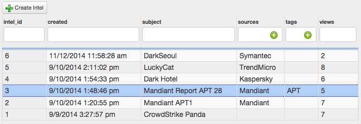
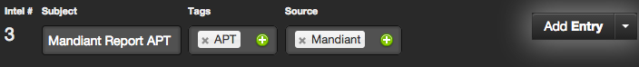
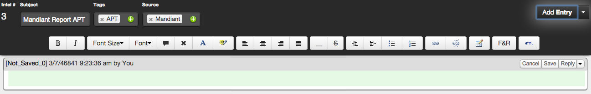
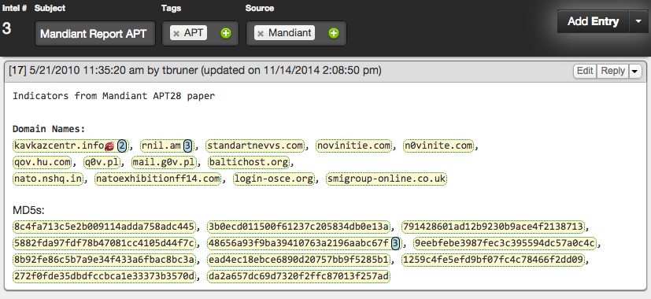
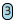

Threat Intel in SCOT
====================

Intel Grid
^^^^^^^^^^^^^^^^^^^^^^^^^

Here we will go more indepth about the threat intel section of SCOT and how you can leverage its capabilities to the fullest.

We'll start by clicking on the 'Intel' button in the top menu, which will take us to intel grid.  You'll see a document already exists ("Intro to SCOT's Threat Intel section"), as well as a 'Create Intel' button in the top left hand corner.

If we wanted to view an existing piece of intel, just click on the row for the docuent you are interested in.  This loads the document in the lower pane of the screen.  Note: Double clicking a row automatically expands the document hidding the grid.

If you want to add a new piece of intel, just click the 'Create Intel' button and a new empty document will be added.  Read the 'Intel Details' section next for information about how to add information to this new Intel Object

Intel Details
^^^^^^^^^^^^^

So, we've created an Intel object, but how do we add our information to it?

First, lets set a subject so everyone else knows what this intel object is about. We do this by clicking in the subject box in the Header of the Intel Details (see image below) and mo
difying the text like we would any other textbox.  Changes to the subject box are saved as you type.

You can see we've added a Tag of 'APT' to improve searching later on.  You can add a tag by clicking on the |add| icon or remove one by clicking on the |x|.

Now that we've set the metadata for our intel object, lets go about actually adding the information and IOCs.

Go ahead and click the "Add Entry" button at the right of the header.  A blank textarea will appear in the details section with a green background (this indicates you are in edit mode).  Additionally, a rich text editor toolbar will appear for advanced formatting.

Go ahead and paste in the report whether from email, a website, or type it in if you want.  Go ahead and click 'Save' and this entry will now be added to this intel object.  Here is what it looks like when we pasted in our indicators

WOAH! Whats with all that |flair|?

* SCOT Automatically extracts IOCs (Domains, IPs, Hashes, Emails, etc.) and hilights them for you.

Why do some of the hilighted parts have numbers like |count| after them?

* The number after a hilighted IOC tells you how many times previously SCOT has seen this indicator.  For example, we've seen *rnil.am* three times previously, and if we want more information, we can click on the Indicator.

Ok, but what about that internet explorer icon |ie| on kavkazcentr.info?

*  SCOT Integrates into your blocklist to automatically tell you which domains are blocked without you having to look it up.  If we had an IP Address, we'd see a small flag like |us| next to it indicating the country the IP Address is registered at.

We refer to the hilighting of IOCs and display of basic information as 'Flair'.

.. |us| image:: _static/images/us.png

.. |flair| raw:: html

   yellow hilighting

