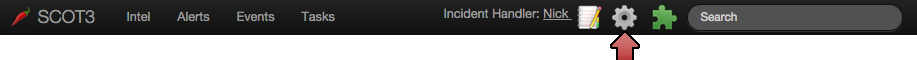
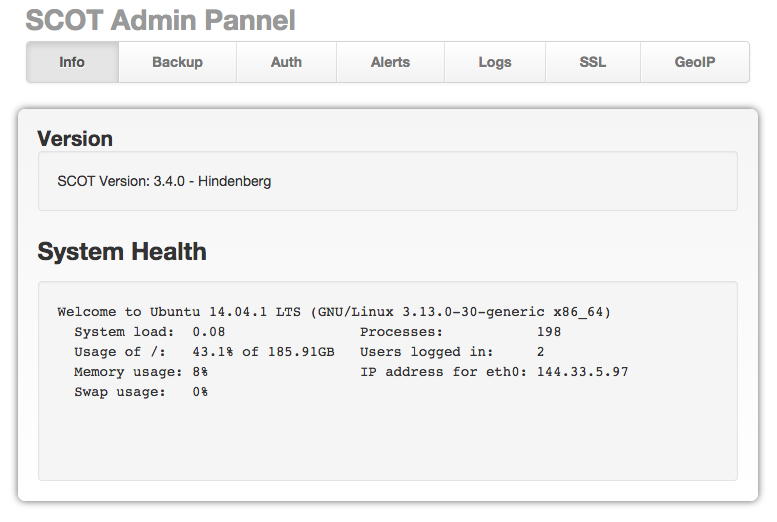
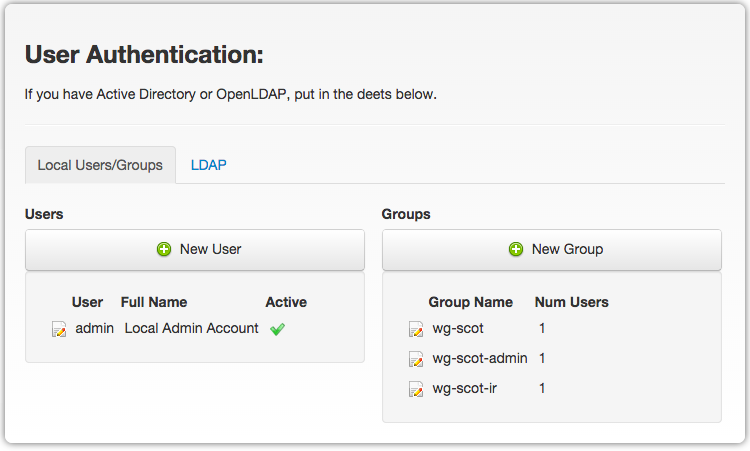
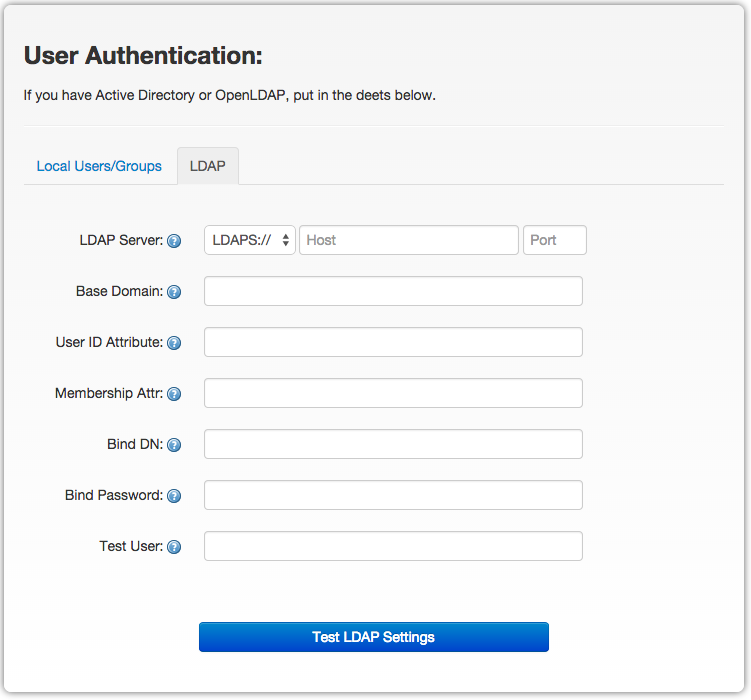
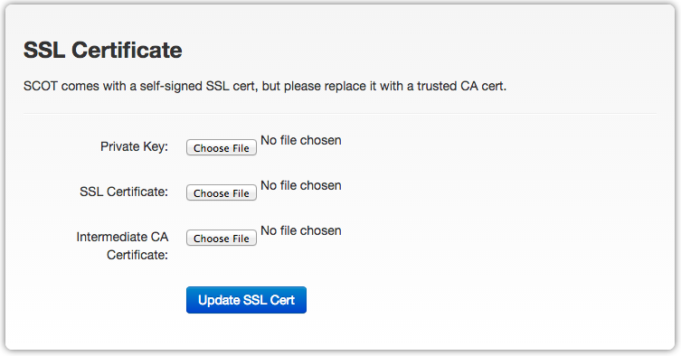
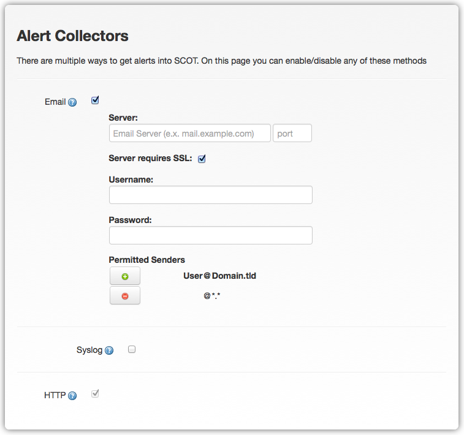

.. _admin:

Admin / Maintenance
================================
Well would you look at that, a nice pretty GUI interface for SCOT Administration.  
To get to this admin interface click on the gear in the top right hand of the page

  
Monitor System Health
^^^^^^^^^^^^^^^^^^^^^
The default admin page is a System Health monitor that presents current statistics about your server.  
Useful in debugging simple isues like full disk, low memory, or high CPU load

.. _auth:

Auth (LDAPs or Local users)
^^^^^^^^^^^^^^^^^^^^^^^^^^^
SCOT supports local user accounts as well as LDAP(S) for those of you who have a central an LDAP setup.  Single sign on capabilities with Kerberos are not yet available, but will be in future releases.

When performing an Auth check, SCOT will attempt to validate the user/pass as a local account first, before attempting to contact LDAP (if LDAP is configured). 

Local users / groups
####################

By default, we have one user created for you 'admin' which is in three groups by default

:admin: Anyone added to this group has Admin privilages in SCOT
:ir:  Default group for incident reponse team
:test: Useful when debugging or running tests 

You can add more users by clicking "New User", or edit an existing user by clicking on the |editIcon| edit icon next to their name. 

When adding a new user or editing an existing one you will be prompted with this form

FORM HERE

Setup LDAP(s)
#############

Simply fill in the LDAP information, and click "Test LDAP Settings".  If the test succeeds, SCOT will display a "Save LDAP Settings" button right below the test button.  

If you have any questions about one or more of the LDAP configuration fields, click on the question mark |questionIcon| in the applicaion for details.

.. _backups:

Backup / Restore / Migration
^^^^^^^^^^^^^^^^^^^^^^^^^^^^

SCOT Supports on-demand backups as well as backups on a schedule, both of which you can do through the admin panel.  

IMAGE OF BACKUP SCREEN HERE WITH AT LEAST ONE BACKUP SHOWING

Once you click on 'Create On-Demand Backup', a spinning icon |loadingIcon| will show until the backup completes.  The backup will then be listed  and available for download by clicking the |downloadIcon| download icon.  

Restoring SCOT will soon be supported from the Admin interface, but for now, you must restore from the terminal by running /opt/sandia/webapps/scot3/bin/restore.sh BACKUP_IMAGE_HERE

To Schedule automatic backups, enter in the cron style schedule and click 'Enable Backups'.  These backups will be in the form of .tgz files containing the entire snapshot of SCOT.  The files are automatically saved under /sdb/backups/ and are rotated every 15 days.  If you want to adjust retention, just modify the 'backup.sh' script in /sdb/backups/backup.sh.i

.. _ssl:

Updating SSL Certificates
^^^^^^^^^^^^^^^^^^^^^^^^^
While SCOT comes with a self signed cert when you install it, we should probably replace it with one signed by a trusted CA.

To update your SSL certificates:

1. Generate an SSL Private key

 * On any Linux / MacOSX system
 * openssl genrsa 2048 > private.key

2. Generate a Certificate Signing Request (CSR)

  * openssl req -new -key private.key -out scot.csr

    * Make sure the 'Common Name' you enter is the same as the server hostname

3. Get the CSR signed by a `Certificate Authority <http://webdesign.about.com/od/ssl/tp/cheapest-ssl-certificates.htm>`_

4. When you get the certificate issued by the Certificate Authoriity

* The private.key file you created in the first step
* The SSL Certificate generated by the Certificate Authority
* If the Certificate Authority has an Intermediate CA Certificate (most do), upload it as well.

.. _alerts:

Configure incoming alert mailbox
^^^^^^^^^^^^^^^^^^^^^^^^^^^^^^^^

If you want to recieve your high confidence alerts in SCOT, you're going to need some way to get them in.  There are currently three supported methods of doing so.
#. REST - HTTP Post (already setup)
#. Email messages to a SCOT specific mailbox (needs configuration)
#. Syslog (Not yet implemented)

To configure SCOT to parse alerts from by email, you'll need to first create an email box just for SCOT.  

Great, now enter in the connection details in the Alert Collectors page (seen above).  Cick the 'Test' button to make sure SCOT can connect to your email server and retrieve alerts.  If this doesn't pass, read the error message returned, which will tell you which part of the connection failed.  If it works, click 'Save', congratulations, you can now recieve email alerts in SCOT.

You might not want to recieve alerts from anyone on the internet though, so you can adjust the list of permitted senders.  By default anyone from any domain can send SCOT an email, but just remove '@*.*' and replace it with something like '@YOUR_COMPANY.GOV' to avoid getting email from unwanted places.

Parsing email based alerts
^^^^^^^^^^^^^^^^^^^^^^^^^^
Now that you can recieve email alerts in SCOT, you may want to define an alert parser.  An alert parser tells SCOT how to interpret the alert, so that we can not only show it in a standard format, but also break the alert down into sub alerts.  This allows SCOT to extract specific other types of data i.e. message_ids, Usernames, and other things that regular expressions can't easily match.  If no parser is defined, don't worry, we'll show it to you in HTML or Text, whichever the email was sent as.  See Advanced Alert Parsing for more details.

Updating GeoIP files
^^^^^^^^^^^^^^^^^^^^

The location and ownership of an IP address is determined using offline MaxMind databases.  Every so often, you've got to update these databases so your location information isn't stale.  You can get a new copy of the location databases free `here <https://www.maxmind.com/en/geolocation_landing>`.  Go ahead and upload those new files into SCOT using the GeoIP update form pictured below.

GEO IP FORM UPLOAD HERE

Additionally, SCOT can use an optional paid database from MaxMind that determines the organization that an IP Address belongs to.  If you have a MaxMind Organization Database subscription, you can upload the organization database here as well.

We reccomend you update once a month.  Eventually, we will automate this process, but for now its manual.

Upgrading SCOT
^^^^^^^^^^^^^^

Currently to upgrade SCOT, you will have to use the terminal. Follow the instructions for how you origionally installed SCOT. 

Docker
######
* docker pull sandia/scot
* restart your docker container

Source
######

* Grab a latest copy of the source 
* Make sure you have internet access & any proxies are set
* **bash install_scot3**

.. |questionIcon| image:: _static/images/question.png

 
