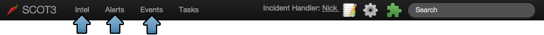
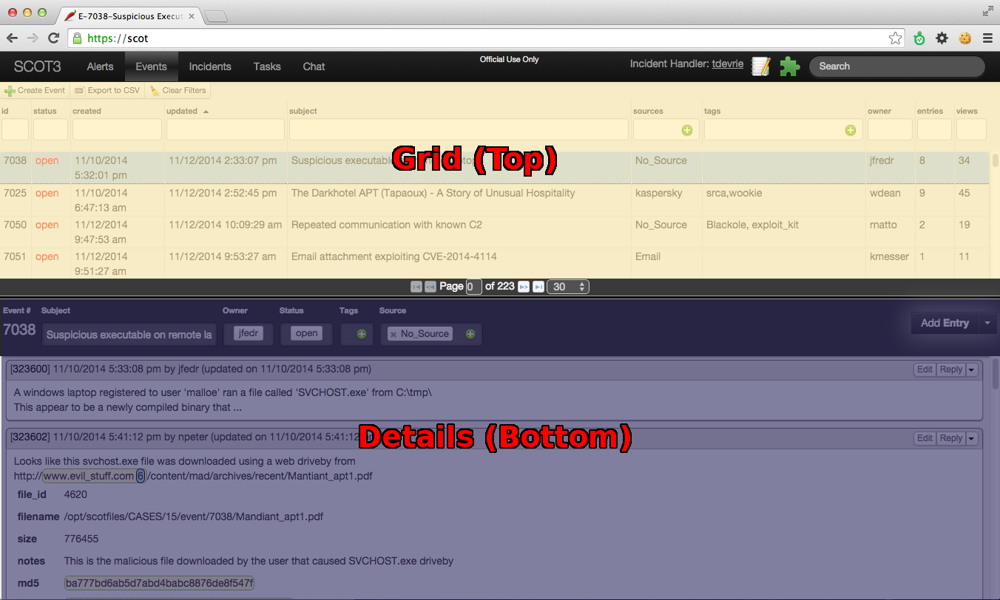

Navigation
^^^^^^^^^^
The header of the main page provides navigation to the various segments of SCOT.

SCOT is split into three main sections: **Intel**, **Alerts**, and **Events**.  Each section consists of a grid on the top and the details view on the bottom.

The Grid on the top lists documents you can view/edit; and the document itself is viewed and edited in the details pane on the bottom.

You will spend most of your time in one of these three sections (Intel, Alerts, Events), so let's go over them quickly.

Intel |gears|
#############

The intel section of SCOT is where you, the user, will put threat intel information of potential relevance to protecting your network. If you enable it, SCOT will automatically pull in several common opensource threat intel feeds. The benefit of this intel section is that everyone on your team will have a centralized place to review threat intel information. Additionally, SCOT will automatically extract IOCs (IPs, Domains, Hashes, Emails, etc.) from this threat intel data and alert you to its presence elsewhere in SCOT.

Alerts |question|
#################

Anytime you have a high confidence alert that needs reviewing by an analyst, this is where you will put it. The Alert section provides real time data about who on your team has triaged which alert(s). Like the intel section, it extracts IOCs and shows correlation information inline. This allows you to instantly tell if anyone on your team has previously investigated a domain, IP, or file, and to review that research.

Events |exclamation|
####################

Here is where you will send most of your time during an investigation of a possible incident.  Multiple analysts can work on a single event simultaneously, sharing their findings, and interacting with integrated external services (VirusTotal, Robtex, GeoIP, Internal Services).  Like alerts, the events section also performs inline IOC correlation.

The Rest
########

Let's go over what's on the right hand side of the navigation bar

* :ref:`Name of the current Incident Handler/Incident Commander <incident_handler>`
* |notebook| :ref:`Scratchpad for quick lookup/correlation <scratchpad>`
* |gear| :ref:`Admin interface <admin>`
* |puzzle| :ref:`Plugins configuration page <plugins>`
* Fulltext search of everything in SCOT

.. |question| raw:: html

   <i class="fa fa-bell"
   style=" padding-top: 2.5px;
    border-radius: 50%;
    color: white;
    background-color: #3E6A77;
    font-size:12px;
    display:inline-block;
    height:18px;
    width:18px;
    text-align:center;
   "></i>

.. |exclamation| raw:: html

   <i class="fa fa-exclamation"
   style=" padding-top: 1px;
    border-radius: 50%;
    color: white;
    background-color: #3E6A77;
    font-size:15px;
    display:inline-block;
    height:18px;
    width:18px;
    text-align:center;
   "></i>

.. |gears| raw:: html

   <i class="fa fa-gears"
   style=" padding: 0;
    border-radius: 50%;
    color: white;
    background-color: #275360;
    font-size:15px;
    display:inline-block;
    height:18px;
    width:18px;
    text-align:center;
   "></i>

.. |notebook| image:: _static/images/notebook.png
   :width: 20px

.. |puzzle| image:: _static/images/puzzle.png
   :width: 20px

