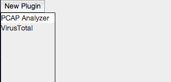
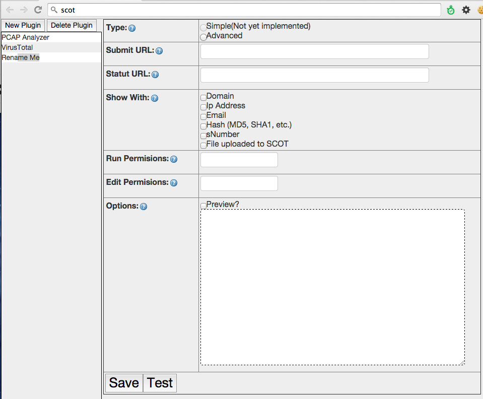

.. _plugins:

Creating a Plugin for SCOT
===============================

The plugin system allows any member of your team to quickly and securely call custom code from SCOT.  In this section, we will show you how to create your own, and share it with others.

Lets start by going to the plugin add/remove section of SCOT.  You can get there by clicking on the |puzzle| icon in the top right hand corner of the screen in SCOT.

On the left hand side, you see the existing plugins, which you can click on to edit.  Lets go ahead and create a new plugin to start out with by clicking 'New Plugin'.  In the left hand side, a new entry is created called "Rename Me", go ahead and click on it which will display the settings and allow you to change the plugin name.  Any changes to the plugin name are automatically saved.

:Type: Currently, SCOT only supports "Advanced" type plugins, so choose the "Advanced" radio button.
:Submit URL: When a SCOT user clicks on your plugin, SCOT will send a HTTP POST call to this URL.  :ref:`See full specification <submit_url>` 
:Status URL: After submitting the indicator, SCOT will poll this URL every 5 seconds to see if there are any new results.  :ref:`See the full specification <status_url>`
:Shows With: Your plugin may only be applicable to certain types of entities, indicate which ones.
:Run Permissions: Which group does a user need to be in to run this plugin?  i.e. 'ir'
:Edit Permissions: Which group does a user need to be in to edit this plugin? i.e. 'admin'
:Options: If you want to prompt for further information before running the plugin, define it in an HTML form here.  :ref:`See full specification <plugin_options>`

.. _submit_url:

Submit URL
^^^^^^^^^^

When a SCOT user invokes your plugin, SCOT performs an HTTP POST to this URL with the following parameters in multipart/form-data format.

:id: Unique Identifier (Incrementing Integer) used to refer to this request
:value: The value of the IOC i.e. (google.com, 8.8.8.8).  If this is a file, this SCOT sends the string 'file'
:file_contents: If your plugin accepts a file, this contains the filename and file contents as a normal multipart/form-data file upload.

The response to this POST should be an HTTP 200 JSON document with an optional parameter **id**.  This optional **id** parameter, overrides the unique ID generated by SCOT.  Even if you don't want to return an **id** field, you still must respond with a valid JSON document. 

Either of the following are acceptable JSON responses.

:Empty Document:   { }
:Override ID: { "id" : "546e66101d3d4b4a2b5e5e3d"}

SCOT will then make note of a successfull invokation of the plugin and start the polling phase (see Status URL). 

However, if SCOT instead recieves an HTTP error code (404, 500, etc.) it will mark this as an error and display an error message to the user.

.. _status_url:

Status URL
^^^^^^^^^^

After SCOT has succesfully submits a plugin request, it will begin to poll (HTTP GET) the Status URL every 5 seconds.

When defining the Status URL in the Plugin Editor, you must place '%id%' somewhere in the URL as this will be replaced with the Unique ID for this plugin invokation. 
   i.e. ``https://scot_plugins.com/pcap/%id%``   ==>   ``https://scot_plugins.com/pcap/12345``    For Unique ID = 12345

SCOT expects to recieve a valid JSON document each time it polls with the following fields

:status: enum{ 'running', 'finished', 'error' }
:results: HTML response to be placed into SCOT

The following would be a valid response

i.e. { "status" : "running", "results": "<b>No bad stuff</b>"}

SCOT will keep polling until it recieves either a status of 'error', or 'finished'.  

While status = 'running', you can keep updating the results, and they will be saved to SCOT and pushed to the user's browser.  This is a good way of updating the user on the progress of the plugin if its going to take a while.

.. _plugin_options:

Options
^^^^^^^

Lets say you want to prompt the user for additional information that your plugin will need.  In this example, we're asking the user for a ranking of the indicator. 

i.e. ``Rating: <input type="text" name="rating"></input>``

This will display a textbox for the user to input a ranking before execting the plugin.  When the plugin is invoked, any serializable fields will be included in the POST to the :ref:`Submit URL <submit_url>`.  If you would like to see how the options will be presented to the user, click the "Preview?" checkbox. 

