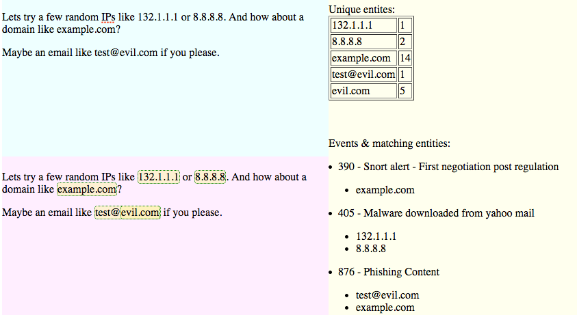

.. _scratchpad:

Scratch Pad
===============================

The ScratchPad allows you to quickly check a large amount of indicators against SCOT.

You can access the scratchpad by clicking on the |scratchpad| icon in the top right hand corner of SCOT.

Enter in text / html into the light blue square and as you type, IOCs will be extracted and shown in the pink square.  SCOT will then be queried for those IOCs, and display its results in the yellow square.

In the yello square, we first see the list of unique IOCs (entities) extracted, and the amount of times they have been seen throughout SCOT.  This gives you a quick way to determine which of the IOCs have been seen before in SCOT.  

Below the unique entities table, we see a list of the locations throughout SCOT these IOCs are seen.  This is helpful to quickly get an idea of which alerts / events / intel are matching and why for further investigation.

This data is no saved anywhere, so we don't clutter up the events or intel sections of SCOT simply to test large lists of IOCs.

